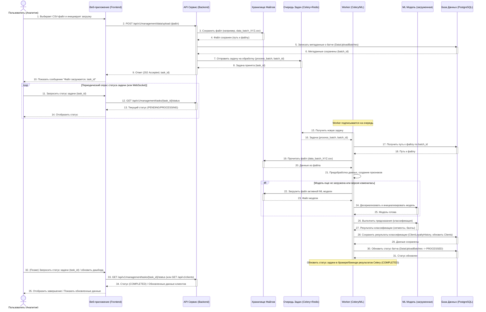

# Архитектура Приложения: Классификация Клиентов Acoola

## 1. Введение

Этот документ описывает архитектуру приложения для классификации клиентов компании Acoola по уровню лояльности. Приложение предназначено для помощи маркетологам и аналитикам в понимании клиентской базы и принятии решений по удержанию и повышению лояльности клиентов.

## 2. Функциональные Требования

### 2.1. Управление Данными Клиентов
- **2.1.1.** Ручная загрузка исходных данных о клиентах и их транзакциях (например, CSV, Excel).
- **2.1.2.** (Опционально) Возможность настройки периодической автоматической загрузки или синхронизации данных из внешних источников (БД, файловые хранилища).

### 2.2. Обработка Данных и Расчет Лояльности
- **2.2.1.** Автоматизированный конвейер предобработки данных (очистка, обработка пропусков, выбросов).
- **2.2.2.** Автоматическое конструирование признаков, релевантных для оценки лояльности.
- **2.2.3.** Применение ML-модели для классификации клиентов по сегментам лояльности.
- **2.2.4.** Возможность пакетной обработки данных для массовой классификации.

### 2.3. Пользовательский Интерфейс (Минимальный / Документация API)
- **2.3.1. Интерактивная документация API (Swagger UI / ReDoc):**
    - Автоматически генерируемый интерфейс FastAPI для исследования всех эндпоинтов API.
    - Возможность выполнять тестовые запросы к API прямо из браузера.
    - Визуализация схем данных запросов и ответов.
    - *Данный интерфейс также служит основным средством для аналитиков и разработчиков для взаимодействия с данными, которые ранее могли бы отображаться в специализированных дашбордах или списках клиентов.*
- **2.3.2. (Опционально) Минимальный Административный Интерфейс:**
    - **2.3.2.1. Управление Моделями ML:**
        - Интерфейс для загрузки новых версий обученных моделей.
        - Выбор активной модели для классификации.
        - Отображение метаданных и метрик качества для загруженных моделей.
    - **2.3.2.2. Просмотр статуса системы:**
        - Базовая информация о работоспособности API и используемой модели.
- **2.3.3. Экспорт Данных (через API):**
    - Функциональность выгрузки данных (списки клиентов, сегменты и т.д.) реализуется через эндпоинты API, которые могут быть вызваны как программно, так и через интерфейс Swagger UI.

### 2.4. Программный Интерфейс (API - RESTful)
- **2.4.1. Эндпоинты для получения данных:**
    - Получение списка клиентов с сегментами лояльности (с параметрами для фильтрации и пагинации).
    - Получение детализированной информации о конкретном клиенте по его ID.
    - Получение статистики по сегментам лояльности.
- **2.4.2. Эндпоинты для управления данными/процессами:**
    - Запуск процесса классификации для новых данных.
    - Загрузка новых данных через API.
- **2.4.3. Эндпоинты для служебной информации:**
    - Получение статуса API, версии используемой модели.

### 2.5. Администрирование и Безопасность
- **2.5.1.** Аутентификация и авторизация пользователей для доступа к веб-интерфейсу и API.
- **2.5.2.** (Опционально) Управление ролями пользователей с разными уровнями доступа.
- **2.5.3.** (Опционально) Логирование ключевых операций в системе.

## 3. Нефункциональные Требования

- **Производительность:**
    - Время ответа API для получения списка клиентов (до 1000 записей с пагинацией): < 1 секунда.
    - Время ответа API для получения детализированного профиля клиента: < 500 мс.
    - Время пакетной классификации 10 000 клиентов: < 5 минут (зависит от сложности модели и данных).
    - Время начальной загрузки дашборда с основными виджетами: < 3 секунды.
- **Масштабируемость:**
    - Система должна поддерживать обработку до 1 миллиона профилей клиентов без существенной деградации производительности.
    - Архитектура должна позволять горизонтальное масштабирование API Сервиса и ML Сервиса (например, запуск нескольких экземпляров за балансировщиком нагрузки).
- **Надежность и Доступность:**
    - Целевая доступность системы (Uptime): 99.5% (исключая плановые окна обслуживания).
    - Система должна быть устойчива к временной недоступности опциональных компонентов (например, если очередь задач не отвечает, базовый функционал должен продолжать работать, где это возможно).
    - Регулярное резервное копирование базы данных.
- **Безопасность:**
    - Защита от основных веб-уязвимостей (согласно OWASP Top 10).
    - Использование HTTPS для всего трафика.
    - Хранение паролей в хешированном виде с использованием современных алгоритмов (например, Argon2, bcrypt).
    - Аутентификация на основе токенов (например, JWT) для API и веб-интерфейса.
    - Авторизация на основе ролей для разграничения доступа к функциям системы.
- **Поддерживаемость:**
    - Код должен следовать согласованным стандартам оформления и быть хорошо структурирован.
    - Наличие документации по API (например, OpenAPI/Swagger).
    - Модульность компонентов для упрощения разработки, тестирования и обновления.
    - Использование системы логирования для отслеживания событий и ошибок.
- **Развертываемость:**
    - Возможность развертывания с использованием Docker-контейнеров.
    - Наличие скриптов или конфигурационных файлов для автоматизации процесса развертывания (например, Docker Compose).
- **Интероперабельность:**
    - Предоставляемый API должен следовать принципам RESTful для упрощения интеграции с внешними системами.

## 4. Архитектура Высокого Уровня

### 4.1. Диаграмма Компонентов (C4 Model - Level 2: Containers)

```mermaid
graph TD
    accTitle: Система Классификации Лояльности Клиентов Acoola - Контейнеры
    accDescr {
        Диаграмма показывает основные контейнеры (приложения, хранилища данных) внутри Системы Классификации Лояльности Клиентов и их взаимодействия, с акцентом на API-first подход.
    }

    subgraph "Интернет"
        User[Пользователь (Аналитик/Разработчик API/Администратор)]
        ExtCRM[Внешняя CRM Система]
        ExtBI[Внешняя BI Система]
    end

    subgraph "Система Классификации Лояльности Клиентов Acoola (Развернуто в Docker)"
        AdminUIDocs["Админ UI / Документация API (FastAPI Auto-Docs + Min Admin UI)"]
        style AdminUIDocs fill:#e6e6fa,stroke:#333,stroke-width:1px
        
        APIService["API Сервис (Python FastAPI)"]
        style APIService fill:#ccf,stroke:#333,stroke-width:2px

        MLService["ML Сервис (Python + ML Libs)"]
        style MLService fill:#cfc,stroke:#333,stroke-width:2px
        
        DB["База Данных (PostgreSQL)"]
        style DB fill:#fcc,stroke:#333,stroke-width:2px
        
        DataStore["Хранилище Файлов (MinIO/Локальное)"]
        style DataStore fill:#f9c,stroke:#333,stroke-width:2px

        Queue["Очередь Задач (Celery + Redis)"]
        style Queue fill:#ffc,stroke:#333,stroke-width:2px
    end

    User --"HTTPS"--> AdminUIDocs
    AdminUIDocs --"API запросы (через Swagger/Admin UI)"--> APIService
    
    APIService --"Обработка данных, запуск ML"--> MLService
    APIService --"Чтение/Запись данных"--> DB
    APIService --"Чтение/Запись файлов (данные, модели)"--> DataStore
    APIService --"Постановка/Получение задач"--> Queue
    
    MLService --"Загрузка моделей"--> DataStore
    MLService --"Запись/Чтение данных (для ML)"--> DB
    MLService --"Выполнение задач из очереди"--> Queue

    ExtCRM --"API запросы (JSON/HTTPS)"--> APIService
    ExtBI --"API запросы (JSON/HTTPS)"--> APIService
    
    classDef user fill:#lightblue,stroke:#333,stroke-width:2px;
    classDef external fill:#lightgrey,stroke:#333,stroke-width:2px;
    class User user;
    class ExtCRM,ExtBI external;
```

### 4.2. Описание Компонентов
*(Будет детализировано)*


#### 4.2.1. Административный UI / Документация API (FastAPI Native + Min Admin UI)
- **Ответственность:**
    - Предоставление интерактивной документации API (Swagger UI / ReDoc), автоматически генерируемой FastAPI. Это основной интерфейс для разработчиков и продвинутых пользователей для изучения эндпоинтов, их параметров, схем данных и тестирования запросов непосредственно из браузера.
    - (Опционально) Предоставление минимального защищенного веб-интерфейса для выполнения ключевых административных задач, которые нецелесообразно или небезопасно выставлять только через публичный API без UI. Например:
        - Загрузка новых версий ML-моделей с валидацией.
        - Выбор и активация ML-модели для использования в предсказаниях.
        - Просмотр расширенного статуса системы, логов операций и базовой статистики использования API.
        - Управление учетными записями администраторов системы.
- **Технологии:**
    - **Интерактивная документация API:** Предоставляется встроенными средствами FastAPI (Swagger UI и ReDoc), доступна по определенному URL (например, `/docs`, `/redoc`).
    - **(Опционально) Кастомный Admin UI:** HTML5, CSS3, JavaScript. Для серверной части административного интерфейса могут использоваться шаблонизаторы (например, Jinja2), интегрированные с FastAPI, для генерации динамического HTML. Аутентификация и авторизация администраторов будет управляться FastAPI. **Решение об использовании сложных Frontend-фреймворков (React, Vue, Angular) для этого компонента не рассматривается в пользу максимальной простоты и интеграции с FastAPI.**
- **Взаимодействие:**
    - С `API Сервис (Backend)`: Отправляет API-запросы (через Swagger UI или формы минимального административного интерфейса) для выполнения соответствующих операций.
    
#### 4.2.2. Сервер Приложений (API Сервис - Backend)
- **Ответственность:**
    - Предоставление RESTful API для взаимодействия с веб-клиентом и внешними системами.
    - Аутентификация и авторизация запросов (проверка токенов, управление сессиями, проверка прав доступа).
    - Реализация основной бизнес-логики приложения:
        - Управление загрузкой и хранением исходных данных.
        - Оркестрация процесса предобработки данных и конструирования признаков (возможно, через вызов ML Сервиса или использование общих библиотек).
        - Инициация процесса классификации клиентов (через ML Сервис).
        - Формирование ответов на запросы (списки клиентов, профили, статистика).
        - Управление метаданными ML моделей (версии, параметры, метрики качества).
    - Взаимодействие с Базой Данных для чтения и записи информации о клиентах, сегментах, моделях, пользователях.
    - Взаимодействие с Хранилищем Файлов для сохранения/загрузки исходных данных и сериализованных моделей.
    - (Если используется) Взаимодействие с Очередью Задач для постановки и отслеживания длительных операций (например, пакетная классификация).
- **Ключевые модули/компоненты (примерно):**
    - `api_routers/`: Модули, определяющие эндпоинты API (например, `clients_router.py`, `auth_router.py`, `models_router.py`).
    - `services/`: Модули с бизнес-логикой (например, `client_service.py`, `prediction_service.py`, `data_processing_service.py`).
    - `core/`: Базовые компоненты (конфигурация, безопасность, утилиты).
    - `db/`: Модули для взаимодействия с базой данных (определение моделей SQLAlchemy/Pydantic, сессии).
    - `schemas/`: Pydantic-схемы для валидации данных запросов и ответов API.
- **Взаимодействие:**
    - С `Веб-клиент (Frontend)`: Принимает HTTPS запросы, возвращает JSON ответы.
    - С `ML Сервис (или модуль)`: Отправляет запросы на классификацию, передает данные для обработки, получает результаты. Может быть как прямой вызов функций (если ML-логика интегрирована), так и HTTP/RPC вызов (если это отдельный сервис).
    - С `База Данных (PostgreSQL)`: SQL-запросы для CRUD операций.
    - С `Хранилище Файлов (MinIO/Локальное)`: Загрузка/скачивание файлов.
    - С `Очередь Задач (Celery + Redis)`: Постановка задач на асинхронное выполнение, получение результатов.
    - С `Внешние Системы`: Принимает HTTPS запросы (если они инициируют взаимодействие), возвращает JSON ответы.
- **Технологии:** Python (FastAPI), Pydantic (для валидации данных), SQLAlchemy (для работы с БД), Alembic (для миграций БД), python-jose или passlib (для JWT/паролей).

#### 4.2.3. Модуль Машинного Обучения (ML Service)
- **Ответственность:**
    - Загрузка и управление версиями обученных ML моделей из Хранилища Файлов.
    - Предоставление интерфейса (внутреннего или HTTP API) для выполнения предсказаний (классификации) на основе переданных данных.
    - Выполнение этапов конвейера ML, специфичных для предсказания:
        - Предобработка входных данных в формат, ожидаемый моделью (если это не сделано полностью на стороне API Сервиса). Это может включать выбор признаков, кодирование, масштабирование и т.д., в соответствии с тем, как модель была обучена.
        - Непосредственно применение модели для получения предсказаний.
        - (Опционально) Расчет интерпретаций для предсказаний (например, SHAP values), если это требуется.
    - (Опционально, если вынесен в отдельный сервис) Обработка задач из Очереди Задач, связанных с длительными ML операциями (например, пакетная классификация).
    - Логирование операций, связанных с ML (загрузка модели, запросы на предсказание, ошибки).
- **Ключевые модули/компоненты (примерно):**
    - `model_loader.py`: Логика загрузки и кэширования моделей из хранилища.
    - `preprocessor.py`: Функции для предобработки данных перед подачей в модель.
    - `predictor.py`: Основная логика выполнения предсказаний.
    - `interpreter.py` (опционально): Логика для генерации объяснений SHAP/LIME.
    - `api_interface.py` (если отдельный сервис): Определение API эндпоинтов для ML Сервиса.
- **Взаимодействие:**
    - С `API Сервис (Backend)`: Получает запросы на предсказание (с данными клиентов), возвращает результаты классификации (и, возможно, интерпретации). Взаимодействие может быть через прямой вызов функций (если ML-модуль является частью API сервиса) или через HTTP/gRPC (если ML Сервис является отдельным микросервисом).
    - С `Хранилище Файлов (MinIO/Локальное)`: Загружает сериализованные ML модели и, возможно, связанные артефакты (например, объекты для предобработки, такие как сохраненные скейлеры или энкодеры).
    - С `База Данных (PostgreSQL)`: Может потребоваться доступ для чтения некоторых данных, необходимых для моделей, или для логирования специфичной информации о предсказаниях, хотя основное взаимодействие с БД обычно идет через API Сервис.
    - С `Очередь Задач (Celery + Redis)`: (Если используется и ML Сервис отдельный) Может забирать задачи на пакетную обработку или другие ML-операции.
- **Технологии:** Python, `scikit-learn`, `pandas`, `numpy`, `XGBoost`, `LightGBM`, `joblib`/`pickle` (для загрузки моделей), `SHAP` (если используется). Если выделяется в отдельный сервис, то может использоваться `FastAPI` или `Flask` для создания легковесного API, или `gRPC` для более производительного межсервисного взаимодействия.

#### 4.2.4. База Данных (PostgreSQL)
- **Ответственность:**
    - Надёжное и согласованное хранение всех структурированных данных приложения.
    - Обеспечение целостности данных через использование первичных/внешних ключей, ограничений (constraints).
    - Предоставление интерфейса для выполнения SQL-запросов от API Сервиса (и, возможно, от ML Сервиса для специфичных нужд).
    - Поддержка транзакций для атомарного выполнения операций.
    - Хранение следующих основных сущностей (детализация будет в разделе "Модель Данных"):
        - `Users`: Информация о пользователях системы (логины, хеши паролей, роли).
        - `Clients`: Профили клиентов (ID, персональные данные, агрегированные RFM-показатели и другие рассчитанные признаки).
        - `ClientTransactions` (или `Purchases`): История транзакций клиентов (если требуется хранить детализацию, а не только агрегаты).
        - `LoyaltySegments`: Определения сегментов лояльности (например, ID, имя сегмента, описание).
        - `ClientLoyaltyHistory`: История присвоения сегментов лояльности клиентам (ID клиента, ID сегмента, дата присвоения).
        - `MLModels`: Метаданные о загруженных и используемых ML моделях (ID модели, имя, версия, дата загрузки, путь к файлу модели в Хранилище Файлов, метрики качества).
        - `DataUploadBatches` (опционально): Информация о загруженных партиях данных (ID батча, дата загрузки, статус обработки, имя файла).
        - `AuditLogs` (опционально): Журнал аудита для ключевых действий в системе.
- **Взаимодействие:**
    - С `API Сервис (Backend)`: Является основным потребителем БД. Выполняет операции CRUD (Create, Read, Update, Delete) через SQL-запросы или ORM (например, SQLAlchemy).
    - С `ML Сервис (или модуль)`: Может иметь ограниченный доступ на чтение для получения данных, необходимых для предсказаний или анализа, если эти данные не передаются полностью через API Сервис. Запись в БД со стороны ML Сервиса должна быть минимизирована и контролируема.
- **Технологии:** PostgreSQL. Для взаимодействия из Python-приложений будет использоваться `SQLAlchemy` (как ORM и/или Core для построения запросов) и `Alembic` (для управления миграциями схемы БД).

#### 4.2.5. (Опционально) Хранилище Данных/Файлов (MinIO / Локальная ФС)
- **Ответственность:**
    - Хранение неструктурированных или больших бинарных данных, которые нецелесообразно или неудобно хранить в реляционной БД.
    - Обеспечение доступа к этим файлам для API Сервиса и ML Сервиса.
    - Основные типы хранимых данных:
        - **Исходные данные клиентов:** Загружаемые пользователем файлы (CSV, Excel и т.п.), содержащие сырые данные для обработки и классификации.
        - **Сериализованные ML модели:** Обученные и сохраненные модели машинного обучения (например, файлы `.pkl`, `.joblib`, `.h5`).
        - **Артефакты ML:** Дополнительные объекты, необходимые для работы моделей, такие как сохраненные скейлеры, энкодеры, словари признаков и т.д.
        - (Опционально) **Промежуточные данные:** Результаты тяжелых этапов обработки данных, если их нужно кэшировать.
        - (Опционально) **Экспортированные отчеты/данные:** Сгенерированные системой файлы для скачивания пользователем.
        - (Опционально) **Системные логи большого объема:** Если не используется специализированная система логирования для больших объемов.
- **Взаимодействие:**
    - С `API Сервис (Backend)`:
        - Записывает загруженные пользователем файлы с исходными данными.
        - Читает/записывает метаданные моделей, в то время как сами файлы могут быть загружены/сохранены ML Сервисом, но API Сервис может управлять путями.
        - Может инициировать загрузку файлов ML моделей в ML Сервис, передавая путь или идентификатор.
        - Может записывать экспортированные отчеты для последующего скачивания пользователем через Веб-клиент.
    - С `ML Сервис (или модуль)`:
        - Читает сериализованные ML модели и их артефакты.
        - Может читать исходные данные, если их обработка происходит непосредственно в ML Сервисе.
        - Может сохранять новые версии моделей или артефактов после переобучения (если такой функционал предусмотрен).
- **Технологии:** MinIO (S3-совместимое объектное хранилище) рекомендуется для гибкости, масштабируемости и возможности последующего перехода в облако. Для упрощения локальной разработки или для небольших инсталляций на начальном этапе может использоваться локальная файловая система сервера, где развернуто приложение. Доступ к файлам осуществляется через стандартные библиотеки Python для работы с файлами или через SDK для S3-совместимых хранилищ (например, `boto3` для MinIO).

#### 4.2.6. (Опционально) Очередь Задач
- **Ответственность:** Управление длительными операциями, такими как пакетная обработка больших датасетов, переобучение моделей, без блокировки основного потока приложения.
- **Технологии (предположительно):** Celery с RabbitMQ/Redis, Kafka.

## 5. Технологический Стек

- **Frontend (UI для администрирования и документации API):** Автоматически генерируемая документация API (Swagger UI / ReDoc) через FastAPI. (Опционально) Минимальный административный интерфейс на базе HTML/CSS/JS с серверной генерацией HTML через FastAPI (например, с использованием шаблонов Jinja2).
- **Backend (API Сервис):** Python (FastAPI) - современный, высокопроизводительный веб-фреймворк для Python, использующий преимущества асинхронности. Встроенная валидация данных с помощью Pydantic и автоматическая генерация документации API (Swagger UI, ReDoc). Отличная интеграция с ML-экосистемой Python.
- **ML Сервис/Модуль:** Python. Может быть частью основного API Сервиса на FastAPI (для простоты) или выделен в отдельный микросервис (если требуется независимое масштабирование или очень ресурсоемкие вычисления). Используемые библиотеки:
    - `pandas` для эффективной обработки и манипуляции данными.
    - `scikit-learn` для базовых алгоритмов машинного обучения, метрик и утилит предобработки.
    - `XGBoost`, `LightGBM` для реализации моделей градиентного бустинга.
    - `Optuna` для автоматической оптимизации гиперпараметров моделей.
    - `SHAP` для интерпретации моделей и объяснения предсказаний.
    - `joblib` или `pickle` для сериализации (сохранения) и десериализации (загрузки) обученных моделей.
- **База Данных:** PostgreSQL - мощная, объектно-реляционная СУБД с открытым исходным кодом. Обеспечивает надежное хранение структурированных данных, поддерживает сложные запросы, транзакции ACID, имеет хорошую поддержку JSON и расширений для различных задач.
- **Хранилище Файлов/Данных:** MinIO - S3-совместимое объектное хранилище с открытым исходным кодом. Подходит для хранения сырых данных (CSV, Excel), сериализованных ML-моделей, логов и других артефактов. Предоставляет API, совместимый с AWS S3, что упрощает миграцию в облако при необходимости. Для упрощенной локальной разработки на начальном этапе можно использовать локальную файловую систему.
- **Очередь Задач (Опционально, если требуются длительные фоновые задачи):** Celery с Redis (в качестве брокера сообщений и бэкенда для хранения результатов). Стандартный и хорошо зарекомендовавший себя выбор в Python-экосистеме для асинхронного выполнения задач, таких как пакетная классификация больших объемов данных или переобучение моделей.
- **Веб-сервер/Обратный Прокси:** Nginx - высокопроизводительный веб-сервер и обратный прокси. Может использоваться для раздачи статического контента фронтенда, терминирования SSL-соединений, балансировки нагрузки между экземплярами API-сервиса, кэширования.
- **Контейнеризация:** Docker и Docker Compose - для создания изолированных, воспроизводимых окружений для каждого компонента приложения. Упрощает разработку, тестирование и развертывание на различных платформах.
- **Система Контроля Версий:** Git (с хостингом на GitHub, GitLab или аналогичном).
- **CI/CD (Непрерывная Интеграция и Доставка):** GitHub Actions (или GitLab CI/CD, Jenkins) - для автоматизации процессов сборки, тестирования и развертывания приложения при внесении изменений в кодовую базу.
- **Мониторинг и Логирование:**
    - **Логирование:** Стандартный модуль `logging` в Python для приложений. Для централизованного сбора и анализа логов можно рассмотреть ELK Stack (Elasticsearch, Logstash, Kibana) или Grafana Loki.
    - **Мониторинг:** Prometheus для сбора метрик (например, количество запросов, время ответа, использование ресурсов) и Grafana для их визуализации и создания дашбордов.

## 6. API Спецификация (Предварительно)
*(Будет детализировано с использованием OpenAPI/Swagger. FastAPI автоматически генерирует документацию в формате OpenAPI.)*

### 6.1. Аутентификация
- Все защищенные эндпоинты требуют `Bearer Token` в заголовке `Authorization`.
- Токен получается через эндпоинт `/api/v1/auth/token`.

### 6.2. Объекты данных (Data Objects / Schemas - Pydantic)

*(Здесь будут описаны основные схемы данных, используемые в запросах и ответах. Например: `ClientBase`, `ClientDisplay`, `LoyaltySegment`, `ModelMetadata`, `Token`, `UserCreate` и т.д. Для краткости пока пропустим детальное описание схем здесь, но они будут важны при реализации.)*

### 6.3. Эндпоинты

#### 6.3.1. Аутентификация (`/api/v1/auth`)
- **`POST /token`**
    - **Описание:** Получение JWT токена для доступа к защищенным ресурсам.
    - **Запрос:** `application/x-www-form-urlencoded` (стандарт для OAuth2/OpenID Connect)
        - `username` (string, required): Имя пользователя.
        - `password` (string, required): Пароль.
    - **Ответ (200 OK):**
        ```json
        {
          "access_token": "string (JWT)",
          "token_type": "bearer"
        }
        ```
    - **Ответ (401 Unauthorized):** Неверные учетные данные.

#### 6.3.2. Клиенты (`/api/v1/clients`)
- **`GET /`**
    - **Описание:** Получить список клиентов с их сегментами лояльности.
    - **Защита:** Требуется аутентификация.
    - **Параметры запроса (query parameters):**
        - `skip` (integer, optional, default: 0): Количество пропускаемых записей (для пагинации).
        - `limit` (integer, optional, default: 100): Максимальное количество возвращаемых записей (для пагинации).
        - `segment_id` (integer, optional): Фильтр по ID сегмента лояльности.
        - `search_query` (string, optional): Поисковый запрос по имени клиента или другим полям.
    - **Ответ (200 OK):**
        ```json
        [
          { // ClientDisplay schema
            "client_id": "string",
            "full_name": "string",
            "loyalty_segment": { "segment_id": "integer", "name": "string" },
            "rfm_score": "float",
            // ... другие ключевые поля
          }
        ]
        ```
- **`GET /{client_id}`**
    - **Описание:** Получить детализированную информацию о конкретном клиенте.
    - **Защита:** Требуется аутентификация.
    - **Параметры пути (path parameters):**
        - `client_id` (string, required): Уникальный идентификатор клиента.
    - **Ответ (200 OK):**
        ```json
        { // ClientDetails schema (расширенный ClientDisplay)
          "client_id": "string",
          "full_name": "string",
          "email": "string",
          "phone_number": "string",
          "loyalty_segment": { "segment_id": "integer", "name": "string", "description": "string" },
          "loyalty_score": "float",
          "rfm_values": { "recency": "integer", "frequency": "integer", "monetary": "float" },
          "transaction_history": [ /* ... */ ],
          // ... другие детали
        }
        ```
    - **Ответ (404 Not Found):** Клиент не найден.

#### 6.3.3. Сегменты Лояльности (`/api/v1/segments`)
- **`GET /stats`**
    - **Описание:** Получить статистику по количеству клиентов в каждом сегменте лояльности.
    - **Защита:** Требуется аутентификация.
    - **Ответ (200 OK):**
        ```json
        [
          {
            "segment_id": "integer",
            "segment_name": "string",
            "client_count": "integer",
            "percentage": "float"
          }
        ]
        ```

#### 6.3.4. Управление Данными и Предсказаниями (`/api/v1/management`)
- **`POST /data/upload`**
    - **Описание:** Загрузить новый файл с данными клиентов (например, CSV) для последующей обработки и классификации.
    - **Защита:** Требуется аутентификация (возможно, с определенной ролью).
    - **Запрос:** `multipart/form-data`
        - `file` (binary, required): Файл с данными.
    - **Ответ (202 Accepted):** Файл принят на обработку. Возвращается ID задачи или батча.
        ```json
        {
          "task_id": "string",
          "message": "File uploaded successfully and is being processed."
        }
        ```
    - **Ответ (400 Bad Request):** Некорректный формат файла или другие ошибки.
- **`POST /predictions/run`**
    - **Описание:** Запустить процесс классификации для ранее загруженного батча данных или для всех необработанных данных.
    - **Защита:** Требуется аутентификация (возможно, с определенной ролью).
    - **Запрос (тело, JSON):** (Опционально, может принимать ID батча)
        ```json
        {
          "batch_id": "string" // опционально, если не указан - обработать все новые
        }
        ```
    - **Ответ (202 Accepted):** Процесс классификации запущен. Возвращается ID задачи.
        ```json
        {
          "task_id": "string",
          "message": "Prediction process started."
        }
        ```
- **`GET /tasks/{task_id}/status`**
    - **Описание:** Получить статус выполнения длительной задачи (загрузка данных, классификация).
    - **Защита:** Требуется аутентификация.
    - **Параметры пути:**
        - `task_id` (string, required): ID задачи.
    - **Ответ (200 OK):**
        ```json
        {
          "task_id": "string",
          "status": "PENDING | PROCESSING | COMPLETED | FAILED",
          "progress_percentage": "integer", // опционально
          "result_url": "string" // опционально, если есть куда перейти по завершению
        }
        ```

#### 6.3.5. Управление Моделями (`/api/v1/models`)
- **`GET /`**
    - **Описание:** Получить список доступных (загруженных) ML моделей с их метаданными.
    - **Защита:** Требуется аутентификация.
    - **Ответ (200 OK):**
        ```json
        [
          { // ModelMetadata schema
            "model_id": "string",
            "model_name": "string",
            "version": "string",
            "upload_date": "datetime",
            "metrics": { /* F1, Precision, Recall, etc. */ },
            "is_active": "boolean"
          }
        ]
        ```
- **`POST /{model_id}/activate`**
    - **Описание:** Сделать указанную модель активной для предсказаний.
    - **Защита:** Требуется аутентификация (административная роль).
    - **Параметры пути:**
        - `model_id` (string, required): ID модели.
    - **Ответ (200 OK):**
        ```json
        {
          "message": "Model activated successfully."
        }
        ```
    - **Ответ (404 Not Found):** Модель не найдена.

#### 6.3.6. Служебная Информация (`/api/v1/service`)
- **`GET /status`**
    - **Описание:** Получить текущий статус API и, возможно, информацию об активной ML модели.
    - **Защита:** Не требуется.
    - **Ответ (200 OK):**
        ```json
        {
          "service_status": "OPERATIONAL",
          "api_version": "string",
          "active_model_info": {
            "model_name": "string",
            "version": "string"
          }
        }
        ```

## 7. Диаграммы Последовательности (Sequence Diagrams)

### 7.1. Загрузка данных и пакетная классификация клиентов



## 8. Модель Данных

Ниже представлена предварительная модель данных для PostgreSQL. Типы данных указаны в общем виде и могут быть уточнены (например, `VARCHAR(255)` вместо `TEXT` для полей с ограниченной длиной).

### 8.1. Таблица `users` (Пользователи системы)
- **Назначение:** Хранение информации о пользователях, имеющих доступ к веб-приложению и API.
- **Поля:**
    - `user_id` (SERIAL PRIMARY KEY): Уникальный идентификатор пользователя.
    - `username` (VARCHAR(100) UNIQUE NOT NULL): Логин пользователя.
    - `hashed_password` (VARCHAR(255) NOT NULL): Хеш пароля.
    - `email` (VARCHAR(255) UNIQUE NOT NULL): Адрес электронной почты.
    - `full_name` (VARCHAR(250)): Полное имя пользователя.
    - `role` (VARCHAR(50) NOT NULL DEFAULT 'analyst'): Роль пользователя (например, 'admin', 'analyst').
    - `is_active` (BOOLEAN NOT NULL DEFAULT TRUE): Флаг активности пользователя.
    - `created_at` (TIMESTAMP WITH TIME ZONE DEFAULT CURRENT_TIMESTAMP): Дата и время создания записи.
    - `updated_at` (TIMESTAMP WITH TIME ZONE DEFAULT CURRENT_TIMESTAMP): Дата и время последнего обновления.

### 8.2. Таблица `clients` (Клиенты)
- **Назначение:** Хранение профилей клиентов компании.
- **Поля:**
    - `client_internal_id` (SERIAL PRIMARY KEY): Внутренний уникальный идентификатор клиента в системе.
    - `client_external_id` (VARCHAR(100) UNIQUE NOT NULL): Внешний идентификатор клиента (из исходной системы).
    - `full_name` (VARCHAR(255)): Полное имя клиента (если доступно).
    - `email` (VARCHAR(255) UNIQUE): Email клиента (если доступно).
    - `phone_number` (VARCHAR(50) UNIQUE): Номер телефона клиента (если доступно).
    - `gender` (VARCHAR(10)): Пол (например, 'male', 'female', 'unknown').
    - `birth_date` (DATE): Дата рождения.
    - `registration_date` (DATE): Дата регистрации клиента.
    - `first_purchase_date` (DATE): Дата первой покупки.
    - `last_purchase_date` (DATE): Дата последней покупки.
    - `total_purchases_amount` (DECIMAL(12, 2) DEFAULT 0.00): Общая сумма покупок.
    - `total_purchases_count` (INTEGER DEFAULT 0): Общее количество покупок.
    - `avg_check_amount` (DECIMAL(10, 2) DEFAULT 0.00): Средний чек.
    - `bonus_balance` (DECIMAL(10, 2) DEFAULT 0.00): Текущий баланс бонусных баллов.
    - `rfm_r` (INTEGER): Recency балл.
    - `rfm_f` (INTEGER): Frequency балл.
    - `rfm_m` (INTEGER): Monetary балл.
    - `rfm_score` (INTEGER): Общий RFM балл/категория.
    - `current_loyalty_segment_id` (INTEGER, FOREIGN KEY REFERENCES `loyalty_segments(segment_id)`): ID текущего сегмента лояльности.
    - `loyalty_score` (FLOAT): Рассчитанный балл лояльности (из улучшенной модели).
    - `communication_prefs` (JSONB): Предпочтения по коммуникациям (например, `{"email_opt_in": true, "sms_opt_in": false}`).
    - `custom_features` (JSONB): Дополнительные кастомные признаки (например, из RFM+, поведенческие).
    - `created_at` (TIMESTAMP WITH TIME ZONE DEFAULT CURRENT_TIMESTAMP): Дата и время создания записи.
    - `updated_at` (TIMESTAMP WITH TIME ZONE DEFAULT CURRENT_TIMESTAMP): Дата и время последнего обновления.

### 8.3. Таблица `loyalty_segments` (Сегменты лояльности)
- **Назначение:** Описание различных сегментов лояльности.
- **Поля:**
    - `segment_id` (SERIAL PRIMARY KEY): Уникальный идентификатор сегмента.
    - `segment_name` (VARCHAR(100) UNIQUE NOT NULL): Наименование сегмента (например, "Чемпионы", "Лояльные", "В зоне риска", "Новички", "Спящие").
    - `description` (TEXT): Описание сегмента и его характеристики.
    - `min_score_threshold` (FLOAT): Минимальный порог балла лояльности для этого сегмента (если применимо).
    - `max_score_threshold` (FLOAT): Максимальный порог балла лояльности для этого сегмента (если применимо).
    - `color_code` (VARCHAR(7)): Цветовой код для визуализации (например, `#FF5733`).
    - `created_at` (TIMESTAMP WITH TIME ZONE DEFAULT CURRENT_TIMESTAMP): Дата и время создания записи.

### 8.4. Таблица `client_loyalty_history` (История сегментов лояльности клиента)
- **Назначение:** Отслеживание изменений сегмента лояльности для каждого клиента во времени.
- **Поля:**
    - `history_id` (SERIAL PRIMARY KEY): Уникальный идентификатор записи истории.
    - `client_internal_id` (INTEGER NOT NULL, FOREIGN KEY REFERENCES `clients(client_internal_id)`): ID клиента.
    - `segment_id` (INTEGER NOT NULL, FOREIGN KEY REFERENCES `loyalty_segments(segment_id)`): ID присвоенного сегмента.
    - `assigned_at` (TIMESTAMP WITH TIME ZONE DEFAULT CURRENT_TIMESTAMP): Дата и время присвоения сегмента.
    - `model_id` (INTEGER, FOREIGN KEY REFERENCES `ml_models(model_id)`): ID ML-модели, использованной для классификации.
    - `loyalty_score_at_assignment` (FLOAT): Балл лояльности клиента на момент присвоения сегмента.
    - `details` (JSONB): Дополнительные детали (например, ключевые факторы, повлиявшие на классификацию).

### 8.5. Таблица `ml_models` (ML Модели)
- **Назначение:** Хранение метаданных о загруженных и используемых ML моделях.
- **Поля:**
    - `model_id` (SERIAL PRIMARY KEY): Уникальный идентификатор модели.
    - `model_name` (VARCHAR(150) NOT NULL): Имя модели (например, "XGBoost_v1.2_Loyalty").
    - `version` (VARCHAR(50) NOT NULL): Версия модели.
    - `description` (TEXT): Краткое описание модели.
    - `file_path` (VARCHAR(255) NOT NULL): Путь к файлу сериализованной модели в хранилище файлов.
    - `upload_date` (TIMESTAMP WITH TIME ZONE DEFAULT CURRENT_TIMESTAMP): Дата загрузки модели.
    - `uploaded_by_user_id` (INTEGER, FOREIGN KEY REFERENCES `users(user_id)`): ID пользователя, загрузившего модель.
    - `metrics` (JSONB): Метрики качества модели (например, `{"f1_macro": 0.85, "precision_macro": 0.82, ...}`).
    - `parameters` (JSONB): Гиперпараметры, с которыми была обучена модель.
    - `feature_list` (JSONB): Список признаков, которые использует модель.
    - `is_active` (BOOLEAN NOT NULL DEFAULT FALSE): Флаг, указывающий, является ли модель текущей активной для предсказаний.
    - `notes` (TEXT): Дополнительные заметки.
    - UNIQUE (`model_name`, `version`)

### 8.6. Таблица `data_upload_batches` (Партии загруженных данных)
- **Назначение:** Информация о загруженных партиях данных для обработки.
- **Поля:**
    - `batch_id` (SERIAL PRIMARY KEY): Уникальный идентификатор партии.
    - `file_name` (VARCHAR(255) NOT NULL): Имя исходного файла.
    - `original_file_path` (VARCHAR(255)): Путь к оригинальному файлу в хранилище (если сохраняется).
    - `uploaded_by_user_id` (INTEGER, FOREIGN KEY REFERENCES `users(user_id)`): ID пользователя, загрузившего партию.
    - `upload_timestamp` (TIMESTAMP WITH TIME ZONE DEFAULT CURRENT_TIMESTAMP): Время загрузки.
    - `status` (VARCHAR(50) NOT NULL DEFAULT 'PENDING'): Статус обработки ('PENDING', 'PROCESSING', 'COMPLETED', 'FAILED').
    - `processing_start_time` (TIMESTAMP WITH TIME ZONE): Время начала обработки.
    - `processing_end_time` (TIMESTAMP WITH TIME ZONE): Время окончания обработки.
    - `total_rows` (INTEGER): Общее количество строк в файле.
    - `processed_rows` (INTEGER): Количество обработанных строк.
    - `error_message` (TEXT): Сообщение об ошибке, если обработка не удалась.
    - `associated_task_id` (VARCHAR(100)): ID связанной задачи в очереди (например, Celery task ID).

### 8.7. (Опционально) Таблица `client_transactions` (Транзакции клиентов)
- **Назначение:** Детализированная история транзакций клиентов. Эта таблица может быть очень большой и ее структура зависит от доступных данных. Альтернативно, можно хранить только агрегаты в таблице `clients`.
- **Поля:**
    - `transaction_id` (SERIAL PRIMARY KEY или VARCHAR PRIMARY KEY, если есть внешний ID): Уникальный идентификатор транзакции.
    - `client_internal_id` (INTEGER NOT NULL, FOREIGN KEY REFERENCES `clients(client_internal_id)`): ID клиента.
    - `transaction_date` (TIMESTAMP WITH TIME ZONE NOT NULL): Дата и время транзакции.
    - `amount` (DECIMAL(10, 2) NOT NULL): Сумма транзакции.
    - `store_id` (VARCHAR(50)): Идентификатор магазина/точки продажи.
    - `product_categories` (JSONB): Категории купленных товаров (например, `["Верхняя одежда", "Обувь"]`).
    - `items_count` (INTEGER): Количество товаров в чеке.
    - `bonus_points_earned` (DECIMAL(10, 2)): Начисленные бонусные баллы.
    - `bonus_points_spent` (DECIMAL(10, 2)): Списанные бонусные баллы.
    - `payment_method` (VARCHAR(50)): Способ оплаты.
    - `discount_amount` (DECIMAL(10, 2)): Сумма скидки.

### 8.8. (Опционально) Таблица `audit_logs` (Журнал аудита)
- **Назначение:** Логирование ключевых действий в системе для целей безопасности и отслеживания.
- **Поля:**
    - `log_id` (SERIAL PRIMARY KEY): Уникальный идентификатор записи лога.
    - `user_id` (INTEGER, FOREIGN KEY REFERENCES `users(user_id)`): ID пользователя, выполнившего действие (может быть NULL для системных событий).
    - `action` (VARCHAR(255) NOT NULL): Описание действия (например, "USER_LOGIN", "MODEL_UPLOADED", "CLIENT_CLASSIFIED").
    - `target_entity` (VARCHAR(100)): Сущность, над которой производилось действие (например, "Client", "MLModel").
    - `target_entity_id` (VARCHAR(100)): ID сущности.
    - `timestamp` (TIMESTAMP WITH TIME ZONE DEFAULT CURRENT_TIMESTAMP): Время события.
    - `details` (JSONB): Дополнительные детали события (например, измененные поля, IP-адрес).

Эта модель данных покрывает основные потребности приложения. Связи между таблицами помогут обеспечить целостность данных. На следующем шаге мы можем обсудить аспекты развертывания или вернуться к детализации других разделов, если это необходимо.

## 9. Аспекты Развертывания

### 9.1. Контейнеризация
- **9.1.1. Docker:** Каждый основной компонент системы (API Сервис, ML Сервис (если выделен), База Данных PostgreSQL, Хранилище Файлов MinIO, Очередь Задач Celery + Redis, Веб-сервер/Прокси Nginx) будет упакован в отдельный Docker-контейнер. Это обеспечит изоляцию, воспроизводимость окружений и упростит развертывание.
- **9.1.2. Docker Compose:** Для локальной разработки и тестирования, а также для развертывания на одиночном сервере, будет использоваться `docker-compose.yml`. Он определит все сервисы, их зависимости, переменные окружения, сетевые настройки и тома для хранения данных.
- **9.1.3. Docker Hub / Приватный Реестр:** Сборки Docker-образов будут публиковаться в Docker Hub (для открытых частей, если таковые будут) или в приватный реестр образов (например, GitLab Container Registry, GitHub Packages, AWS ECR, Google Artifact Registry) для безопасного хранения и распространения.

### 9.2. Окружения
- **9.2.1. Локальная разработка (Local/Development):**
    - Запуск всех компонентов через Docker Compose.
    - Использование легковесных версий сервисов, где это возможно (например, SQLite вместо PostgreSQL для быстрых тестов, если это допустимо на ранних этапах).
    - Подробное логирование, включенный режим отладки для FastAPI.
    - Данные могут быть тестовыми или небольшим срезом реальных данных.
- **9.2.2. Тестирование/Стейджинг (Staging):**
    - Окружение, максимально приближенное к продуктивному.
    - Развертывание на выделенном сервере или в облачной среде.
    - Использование полных версий всех сервисов (PostgreSQL, MinIO, Redis).
    - Загрузка копии продуктивных данных (анонимизированных, если необходимо) или репрезентативного набора данных.
    - Проведение интеграционного, нагрузочного и пользовательского тестирования (UAT).
- **9.2.3. Продуктивное окружение (Production):**
    - Развертывание на надежных серверах (физических или облачных).
    - Настройка резервного копирования для Базы Данных и Хранилища Файлов.
    - Конфигурация Nginx как обратного прокси для терминирования SSL, балансировки нагрузки (если несколько экземпляров API/ML сервисов), раздачи статики (для минимального Admin UI).
    - Управление секретами (ключи API, пароли к БД) через переменные окружения или специализированные системы управления секретами (например, HashiCorp Vault, AWS Secrets Manager).
    - Настройка мониторинга и логирования.

### 9.3. Непрерывная Интеграция и Непрерывная Доставка (CI/CD)
- **9.3.1. Система контроля версий:** Git, с хостингом на GitHub, GitLab или аналогичной платформе.
- **9.3.2. Автоматизированная сборка:** Использование CI/CD инструментов (например, GitHub Actions, GitLab CI/CD, Jenkins) для автоматической сборки Docker-образов при каждом коммите в основную ветку или при создании тега релиза.
- **9.3.3. Автоматизированное тестирование:** Запуск юнит-тестов, интеграционных тестов и линтеров в рамках CI-пайплайна. Сборка будет прерываться при неудачных тестах.
- **9.3.4. Автоматизированное развертывание (CD):**
    - На стейджинг-окружение: Автоматическое развертывание после успешной сборки и прохождения тестов на основной ветке разработки.
    - На продуктивное окружение: Может быть ручным (по кнопке после утверждения) или автоматическим для релизных тегов, с использованием стратегий, минимизирующих время простоя (например, blue/green deployment, canary releases – хотя для данного масштаба это может быть избыточно на начальном этапе).
- **9.3.5. Управление миграциями БД:** Миграции схемы базы данных (с использованием Alembic) должны быть частью процесса развертывания и применяться автоматически или полуавтоматически перед запуском новой версии приложения.

### 9.4. Конфигурация
- **9.4.1. Переменные окружения:** Основной способ конфигурации приложения для различных окружений (пути к БД, ключи API, настройки сервисов). Docker Compose и системы оркестрации (если будут использоваться) позволяют легко управлять ими.
- **9.4.2. Файлы конфигурации:** Для более сложных конфигураций (например, настройки Nginx, параметры ML-моделей по умолчанию) могут использоваться файлы конфигурации, которые монтируются в Docker-контейнеры. Некоторые из них могут быть шаблонизированы и заполняться на этапе CI/CD или при запуске.

### 9.5. Масштабирование (начальные соображения)
- **9.5.1. API Сервис и ML Сервис:** Могут быть масштабированы горизонтально путем запуска нескольких экземпляров контейнеров за балансировщиком нагрузки (Nginx). Это требует, чтобы сервисы были stateless или корректно управляли состоянием (например, через Redis для сессий, если они есть).
- **9.5.2. База Данных:** Масштабирование PostgreSQL может включать настройку репликации (read replicas) для распределения нагрузки на чтение.
- **9.5.3. Очередь Задач:** Количество worker'ов Celery можно увеличивать для обработки большего числа фоновых задач.

### 9.6. Резервное копирование и Восстановление
- **9.6.1. База Данных (PostgreSQL):** Настройка регулярного автоматического резервного копирования (например, `pg_dump`) с хранением бэкапов в надежном месте (например, в S3-совместимом хранилище). Проверка процедур восстановления.
- **9.6.2. Хранилище Файлов (MinIO):** Если используется MinIO, настроить его собственные механизмы репликации или резервного копирования бакетов. Для локальной ФС – стандартные утилиты бэкапа.
- **9.6.3. Конфигурации и код:** Регулярные коммиты в Git и бэкапы CI/CD сервера (если он содержит важные артефакты или конфигурации).

### 9.7. Безопасность развертывания
- **9.7.1. Минимизация привилегий:** Запуск контейнеров от имени непривилегированных пользователей.
- **9.7.2. Сетевая безопасность:** Настройка фаерволов, ограничение доступа к портам только для необходимых сервисов. Использование HTTPS для всего внешнего трафика.
- **9.7.3. Обновления безопасности:** Регулярное обновление базовых Docker-образов, операционных систем и всех зависимостей приложений для устранения известных уязвимостей.
- **9.7.4. Управление секретами:** Не хранить секреты в коде или Docker-образах. Использовать переменные окружения, передаваемые при запуске контейнеров, или специализированные инструменты управления секретами.

### 9.8. Мониторинг и Логирование (детальнее, чем в стеке)
- **9.8.1. Сбор Метрик:**
    - **Приложение:** FastAPI может предоставлять метрики через эндпоинт (например, с использованием `starlette-prometheus`). Метрики включают количество запросов, время ответа, количество ошибок, состояние очередей Celery.
    - **Инфраструктура:** Метрики использования CPU, памяти, диска, сети для хостов и контейнеров.
    - **Инструменты:** Prometheus для сбора и хранения метрик.
- **9.8.2. Визуализация и Алёртинг:**
    - **Инструменты:** Grafana для создания дашбордов на основе метрик из Prometheus.
    - **Алёрты:** Настройка правил в Alertmanager (часть Prometheus/Grafana стека) для уведомления о критических проблемах (например, высокая частота ошибок API, недоступность сервиса, переполнение диска).
- **9.8.3. Централизованное Логирование:**
    - **Приложения:** Все компоненты (API сервис, ML сервис, Celery workers) должны писать логи в stdout/stderr внутри контейнеров.
    - **Сборщик логов:** Docker-драйвер для логирования или специализированный агент (например, Fluentd, Filebeat) для сбора логов из контейнеров.
    - **Система хранения и анализа логов:** ELK Stack (Elasticsearch, Logstash, Kibana) или Grafana Loki для агрегации, поиска и анализа логов. Это позволяет быстро находить проблемы и отслеживать поведение системы.

## 10. Решения и Компромиссы

В этом разделе документируются основные архитектурные решения, принятые в ходе проектирования системы классификации лояльности клиентов, их обоснование, а также рассмотренные альтернативы и компромиссы.

### 10.1. Выбор Технологического Стека

- **10.1.1. Python (FastAPI) для Backend (API Сервис и ML Сервис):**
    - **Решение:** Использовать Python с фреймворком FastAPI.
    - **Обоснование:**
        - Python является стандартом де-факто для задач машинного обучения и анализа данных, имеет богатую экосистему библиотек (Pandas, Scikit-learn, XGBoost, LightGBM, Optuna, SHAP).
        - FastAPI – современный, высокопроизводительный фреймворк, построенный на Starlette и Pydantic. Он обеспечивает асинхронность "из коробки", автоматическую валидацию данных и генерацию OpenAPI документации (Swagger UI, ReDoc), что идеально подходит для API-first подхода.
        - Легкость интеграции ML-кода непосредственно в API-сервис или выделенный ML-сервис на том же стеке.
    - **Альтернативы:** Node.js (Express/NestJS), Java (Spring Boot), Go. Были отклонены из-за менее тесной интеграции с ML-экосистемой Python или большей сложности для данной команды/проекта.
    - **Компромиссы:** GIL в Python может быть ограничением для некоторых CPU-bound задач, но асинхронность FastAPI и возможность выноса тяжелых вычислений в Celery workers или отдельные процессы/сервисы минимизируют эту проблему для I/O-bound операций API.

- **10.1.2. PostgreSQL для Базы Данных:**
    - **Решение:** Использовать PostgreSQL.
    - **Обоснование:**
        - Мощная, надежная, объектно-реляционная СУБД с открытым исходным кодом.
        - Отличная поддержка JSON/JSONB, что полезно для хранения гибких структур данных (например, `custom_features` у клиентов, `metrics` у моделей).
        - Транзакционная целостность (ACID).
        - Широкие возможности для сложных запросов, индексации и масштабирования (репликация).
    - **Альтернативы:** MySQL, MongoDB. MySQL менее функционален в части поддержки JSON. MongoDB (NoSQL) могла бы подойти для некоторых частей данных, но для обеспечения целостности связей между сущностями (клиенты, модели, сегменты) реляционная модель PostgreSQL предпочтительнее.
    - **Компромиссы:** Может требовать больше ресурсов и более сложной настройки по сравнению с некоторыми NoSQL решениями для очень больших объемов неструктурированных данных, но для данной задачи ее преимущества перевешивают.

- **10.1.3. Минималистичный Frontend (FastAPI Auto-Docs + Опциональный Admin UI):**
    - **Решение:** Ориентироваться на API-first подход. Основной UI – автоматически генерируемая документация API (Swagger). Дополнительно – очень простой административный UI на HTML/CSS/JS с серверной генерацией через FastAPI/Jinja2, без использования тяжелых JS-фреймворков.
    - **Обоснование:**
        - Снижение сложности и времени разработки фронтенда.
        - Основная ценность приложения – в его API и ML-логике, которые могут быть интегрированы в любые внешние системы (CRM, BI).
        - Swagger UI, предоставляемый FastAPI, достаточен для интерактивного исследования и тестирования API.
        - Минимальный Admin UI нужен только для задач, неудобных или небезопасных для выполнения исключительно через API без UI (например, загрузка файлов моделей с валидацией).
    - **Альтернативы:** Полнофункциональный SPA на React/Vue/Angular. Отклонено из-за увеличения трудоемкости разработки и смещения фокуса с основной, API-ориентированной задачи.
    - **Компромиссы:** Ограниченные возможности пользовательского интерфейса по сравнению с полноценным SPA. Однако, это осознанный компромисс в пользу скорости разработки и фокуса на API.

- **10.1.4. Docker и Docker Compose для Контейнеризации и Оркестрации (на начальном этапе):**
    - **Решение:** Использовать Docker для упаковки всех компонентов и Docker Compose для управления ими в средах разработки и тестирования, а также для простого развертывания на одном сервере.
    - **Обоснование:**
        - Обеспечение согласованности окружений.
        - Упрощение развертывания и управления зависимостями.
        - Docker Compose легок в освоении и достаточен для данного масштаба проекта на начальных этапах.
    - **Альтернативы:** Kubernetes (k8s) для оркестрации. K8s является более мощным, но и значительно более сложным решением. Для текущего проекта и предполагаемых начальных масштабов его использование избыточно и приведет к неоправданному усложнению.
    - **Компромиссы:** Docker Compose менее гибок для управления очень большими и сложными развертываниями по сравнению с Kubernetes, но его простота является преимуществом на данном этапе. Переход на Kubernetes возможен в будущем при необходимости.

- **10.1.5. Celery с Redis для Асинхронных Задач:**
    - **Решение:** Использовать Celery с Redis в качестве брокера сообщений и бэкенда результатов для выполнения длительных задач (например, пакетная классификация).
    - **Обоснование:**
        - Стандартное и хорошо зарекомендовавшее себя решение в экосистеме Python.
        - Позволяет разгрузить API-сервис от длительных операций, улучшая его отзывчивость.
        - Redis прост в настройке и использовании в качестве брокера для Celery.
    - **Альтернативы:** RabbitMQ (более функциональный, но и более сложный брокер), Kafka (для потоковой обработки, что здесь избыточно), встроенные фоновые задачи FastAPI (менее мощные для управления очередями и распределенными worker'ами).
    - **Компромиссы:** Добавляет еще один компонент в систему, который нужно поддерживать.

### 10.2. Архитектурные Паттерны и Принципы

- **10.2.1. Микросервисный подход (умеренный):**
    - **Решение:** Выделение API Сервиса, ML Сервиса (может быть частью API или отдельным), Базы Данных, Хранилища Файлов и Очереди Задач в отдельные, независимо развертываемые компоненты (контейнеры).
    - **Обоснование:** Улучшение модульности, возможности независимого масштабирования и обновления компонентов. Четкое разделение ответственности.
    - **Компромиссы:** Усложнение взаимодействия между сервисами (сетевые вызовы вместо прямых вызовов функций), необходимость управления большим количеством компонентов. Для ML-сервиса рассматривается вариант как тесной интеграции с API-сервисом (для простоты на старте), так и полного выделения (для масштабируемости).

- **10.2.2. API-First Design:**
    - **Решение:** Проектирование системы с акцентом на предоставление качественного и хорошо документированного API как основного интерфейса взаимодействия.
    - **Обоснование:** Обеспечивает гибкость интеграции с другими системами, упрощает разработку клиентов (включая минимальный Admin UI), способствует четкому определению контрактов между компонентами.
    - **Компромиссы:** Может потребовать больше времени на начальное проектирование API по сравнению с монолитным подходом, где UI и бэкенд тесно связаны.

- **10.2.3. Stateless API Сервисы:**
    - **Решение:** Стремиться к тому, чтобы API Сервис и ML Сервис были stateless, то есть не хранили состояние сессии между запросами. Любое необходимое состояние должно храниться во внешних хранилищах (БД, кэш Redis).
    - **Обоснование:** Упрощает горизонтальное масштабирование и повышает отказоустойчивость (запросы могут обрабатываться любым экземпляром сервиса).
    - **Компромиссы:** Может потребовать более частого обращения к внешним хранилищам для получения контекста.

### 10.3. Прочие Решения

- **10.3.1. Хранение ML Моделей и Данных:**
    - **Решение:** Сериализованные ML модели и исходные файлы данных хранятся в объектном хранилище (MinIO или локальная ФС), а метаданные о них (версии, пути, метрики) – в PostgreSQL.
    - **Обоснование:** Разделение хранения бинарных "тяжелых" артефактов и структурированных метаданных. Объектное хранилище лучше подходит для файлов, БД – для запросов по метаданным.
    - **Компромиссы:** Необходимость синхронизации между записями в БД и фактическим наличием файлов в хранилище.

- **10.3.2. Аутентификация и Авторизация:**
    - **Решение:** JWT (JSON Web Tokens) для аутентификации API-запросов. Управление ролями для базовой авторизации (например, 'admin', 'analyst' – для доступа к административным функциям).
    - **Обоснование:** JWT является стандартным и безопасным способом для stateless аутентификации в API. Ролевая модель проста для реализации и достаточна для текущих нужд.
    - **Компромиссы:** Для очень гранулярного контроля доступа может потребоваться более сложная система авторизации (например, на основе политик или ACL).